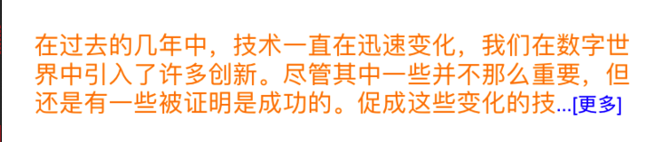
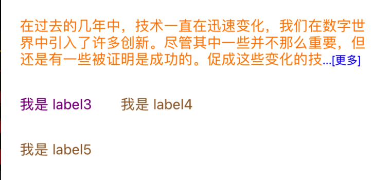

# EasyLabel

相当于 `UILabel`，用于简单文本显示，基于 `CoreText` 实现, 支持以下功能

* `displaysAsynchronously`： 异步绘制
*  `truncationToken`：截断提示
* `lineBreakMode`: 截断方式
* `text`: 显示文本
* `font`: 文本字体
* `textColor`：文本颜色
* `textAlignment`：对齐方式
* 自动布局

### 异步绘制

```swift
let label = UILabel()
label.displaysAsynchronously = true // 默认为 true
```

### 截断提示

```swift
// 超过 3 行显示 ...[展开]
let text = "在过去的几年中，技术一直在迅速变化，我们在数字世界中引入了许多创新。尽管其中一些并不那么重要，但还是有一些被证明是成功的。促成这些变化的技术之一是增强现实，它对包括零售、游戏和娱乐在内的许多行业产生了重大影响。AR还影响了数字通信领域，在发生疫情初期，我们当中许多人不得不开始在家中进行日常工作，学习和其他活动，这一点尤其明显。"
let labelWidth = screenWidth-20*2
let labelHeight = text.height(with: labelWidth, font: textFont, numberOfLines: 5, lineBreakMode: .byTruncatingTail)

let label = EasyLabel(frame: CGRect(x: 20, y: 100, width: labelWidth, height: labelHeight))
label.numberOfLines = 3
label.lineBreakMode = .byTruncatingTail
label.font = textFont
label.textColor = .orange
label.text = text
label.truncationToken = NSAttributedString(string: "...[更多]", attributes: [NSAttributedString.Key.foregroundColor: UIColor.red])
self.view.addSubview(label)
```




### 自动布局

```swift
// 超过 5 行显示 ...[展开]
let text2 = "在过去的几年中，技术一直在迅速变化，我们在数字世界中引入了许多创新。尽管其中一些并不那么重要，但还是有一些被证明是成功的。促成这些变化的技术之一是增强现实，它对包括零售、游戏和娱乐在内的许多行业产生了重大影响。AR还影响了数字通信领域，在发生疫情初期，我们当中许多人不得不开始在家中进行日常工作，学习和其他活动，这一点尤其明显。"
let label2 = EasyLabel()
label2.preferedMaxLayoutWidth = labelWidth
label2.numberOfLines = 3
label2.lineBreakMode = .byTruncatingTail
label2.font = textFont
label2.textColor = .orange
label2.text = text2
label2.truncationToken = NSAttributedString(string: "...[更多]", attributes: [NSAttributedString.Key.foregroundColor: UIColor.blue])
self.view.addSubview(label2)

label2.snp.remakeConstraints { (make) in
    make.left.right.equalToSuperview().inset(20)
    make.top.equalToSuperview().inset(100)
}

let label3 = EasyLabel()
label3.preferedMaxLayoutWidth = labelWidth
label3.font = textFont
label3.textColor = .purple
label3.text = "我是 label3"
self.view.addSubview(label3)

label3.snp.remakeConstraints { (make) in
    make.top.equalTo(label2.snp.bottom).offset(30)
    make.left.equalToSuperview().inset(20)
}

let label4 = EasyLabel()
label4.preferedMaxLayoutWidth = labelWidth
label4.font = textFont
label4.textColor = .brown
label4.text = "我是 label4"
self.view.addSubview(label4)

label4.snp.remakeConstraints { (make) in
    make.top.equalTo(label2.snp.bottom).offset(30)
    make.left.equalTo(label3.snp.right).offset(30)
}

let label5 = EasyLabel()
label5.preferedMaxLayoutWidth = labelWidth
label5.font = textFont
label5.textColor = .brown
label5.text = "我是 label5"
self.view.addSubview(label5)

label5.snp.remakeConstraints { (make) in
    make.top.equalTo(label3.snp.bottom).offset(30)
    make.left.equalTo(label3.snp.left)
}
```


